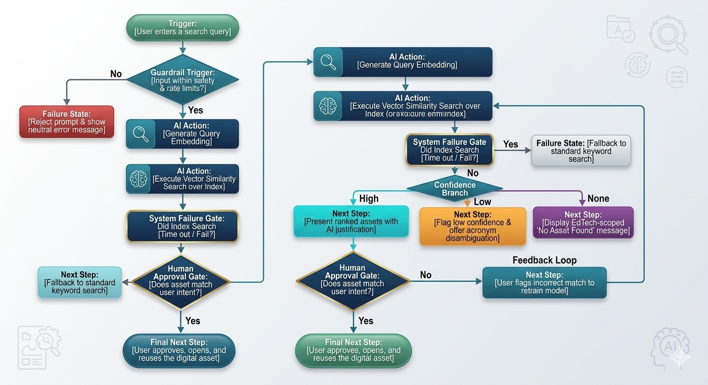
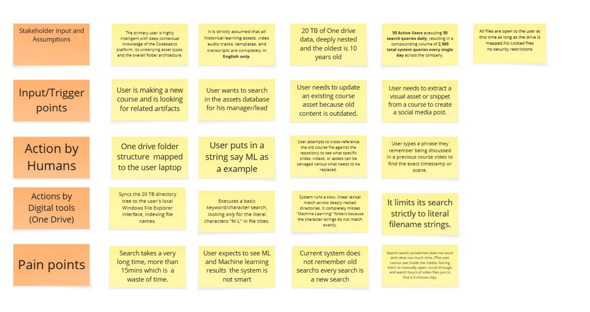
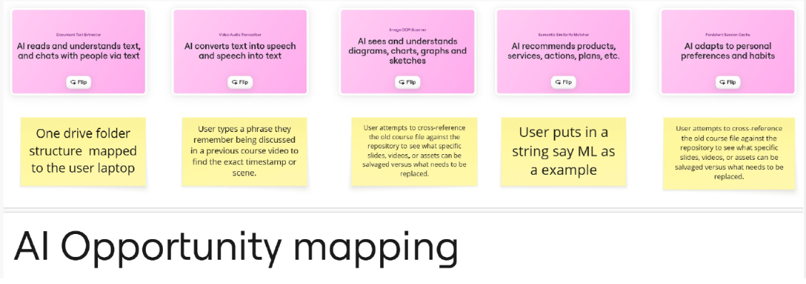
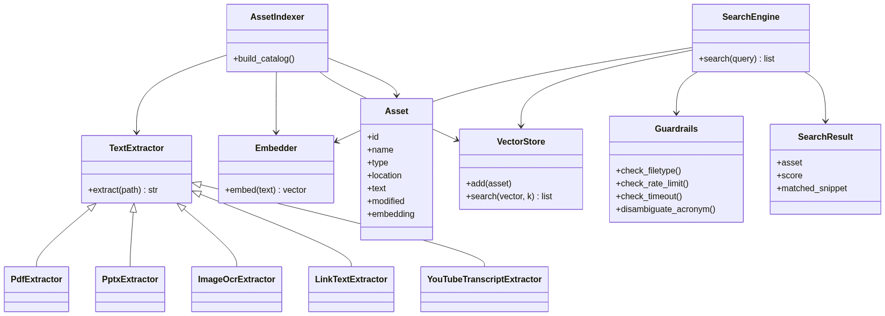

# 🔍 Codebasics Digital Asset Assistant

> **AI PM Capstone 2** — an AI system that lets a content team **find any asset by meaning, not by filename**, so they stop recreating work that already exists.


▶️ **[Try the live app →](https://digitalsearchassistant-codebasics1.streamlit.app/)** 

📺 **[Watch the project demo video on YouTube →](https://www.youtube.com/watch?v=DsQPJOJNNYo&t=149s)**

_No setup needed — search `power bi thumbnail`, `star schema`, or `machine learning`. (Deployed free on Streamlit Community)_


A decade of creation leaves thousands of assets — course videos, YouTube tutorials, thumbnails, decks, PDFs — scattered across drives with inconsistent names (`final`, `final_v2`, `FINAL_USE_THIS`). Nobody can search *inside* a video or an image, so teams **search, give up, and recreate**. This project fixes that.

---

## 🎯 The problem, in numbers

| | |
|---|---|
| **20 TB** | of deeply-nested, decade-old assets |
| **2,500** | searches per day across a 50-person team |
| **15+ min** | per search — and it often fails |
| **Result** | duplicated decks, thumbnails, and videos |

**Root cause:** Codebasics has no record of what its assets *contain*, so no one can find work by *meaning* — and teams recreate what already exists.

## 💡 The solution

A **local, semantic search**. It reads the text *inside* files (and *inside* YouTube videos via transcripts), turns everything into embeddings **on-device** (open-source, ~$0, private), and returns the right asset with the reason it matched.

**Search by meaning → get the exact file, its location, the slide/page, and a download.**



---

## 🧭 The user journey (current state)



**Triggers:** a creator is building a new course, updating an outdated asset, or extracting a snippet for a social post. **Today:** they map the drive and type a string (e.g. `ML`) into Windows Explorer → it matches only literal filenames, misses "Machine Learning", and can't see inside decks or videos → **15+ minutes, gives up, recreates.**

## 🎯 AI opportunity mapping

Each job the user needs → the specific AI capability that solves it:

| Opportunity (the job) | AI capability |
|---|---|
| Understand a query's *meaning* — so "ML" finds "Machine Learning" | Semantic search via text **embeddings** (RAG retrieval) |
| Read the text *inside* PDFs and PowerPoint decks | Document text extraction |
| Read the text printed *inside* images/thumbnails | Image OCR *(v2; filename in v1)* |
| Find *what's said inside* a video + jump to the moment | Transcript + timestamps |
| Rank and return the best matches with the reason | Vector similarity ranking + structured output |

**Deliberately NOT AI:** filetype filtering, recency sorting, and search history are plain logic — AI is used only where *meaning* is required.

---

## 🗂️ The 7 capstone steps

| # | Step | Deliverable |
|---|------|-------------|
| 1 | **Problem discovery & user research** (persona, empathy map, 5-Whys, root cause) | [Step 1 (docx)](Deliverables/Step1_DigitalAsset_Problem_Discovery_User_Research.docx) |
| 2 | **AI opportunity mapping** (user journey, opportunity map, architecture, risks) | [Journey](Deliverables/Step2_UshaDigitalAssistant_UserJourney.pdf) · [Opportunity](Deliverables/Step2_UshaDigitalAssistant_AIOpportunityMapping.pdf) · [Block diagram](Deliverables/Step2_UshaDigitalAssistant%20_SystemBlockDiagram.pdf) · [Risks](Deliverables/Step2_UshaDigitalAssistant_Risks.pdf) |
| 3 | **AI PRD** (North Star, guardrails, evals, model strategy) | [Step 3 (docx)](Deliverables/Step3_DigitalAsset_AI_PRD.docx) |
| 4 | **Cost estimation** (local/free vs paid cloud) | [Step 4 (xlsx)](Deliverables/Step4_DigitalAsset_Cost_Estimation.xlsx) |
| 5 | **Working prototype** (this code) | `src/assistant/`, `src/streamlit_app.py` |
| 6 | **Presentation** | [Step 6 (pptx)](Deliverables/Step6_DigitalAsset_Presentation.pptx) |
| 7 | **Stakeholder demo video** | [Watch on YouTube](https://www.youtube.com/watch?v=DsQPJOJNNYo&t=149s) |

---

## 🏗️ How it's built (object-oriented)



| Module | Role |
|--------|------|
| `src/assistant/models.py` | `Asset`, `SearchResult` data objects |
| `src/assistant/extractors.py` | `TextExtractor` → `Pdf` / `Pptx` / `Image` / `YouTubeTranscript` extractors |
| `src/assistant/embedder.py` | `Embedder` — text → vector (swap to change models) |
| `src/assistant/vector_store.py` | `VectorStore` — holds vectors, finds closest |
| `src/assistant/indexer.py` | `AssetIndexer` — builds the index (with transcript caching) |
| `src/assistant/search_engine.py` | `SearchEngine` — the core: query → ranked results |
| `src/assistant/guardrails.py` | `Guardrails` — allowlist, rate limit, English-only, acronyms |

**Pipeline:** read text inside files & videos → embed (local) → on-device index → search + rank by relevance then recency → deliver the file.

## 🛡️ Grounded & safe by design

- **Retrieval-only** — it can only return assets that *exist*; it never generates or fabricates.
- **Local** — proprietary content never leaves the machine.
- **Explainable** — every result shows *why* it matched.
- **Guardrails** — filetype allowlist (ignores `.zip`), out-of-domain "EdTech only" message, English-only, rate limit + timeout.

### Guardrails & failure modes

| Risk | Guardrail |
|---|---|
| Hallucination (fake asset) | Retrieval-only — can only return assets that exist |
| Privacy (proprietary IP) | Runs locally — content never leaves the machine |
| Outdated / wrong match | Show *why* it matched + rank newest first |
| Off-topic input (e.g. "biryani") | Below-threshold → "EdTech only" message, never a weak guess |
| Non-English / abusive input | English-only nudge; per-session rate limit + query timeout |
| Wrong file types | Allowlist — ignore `.zip`, video files, etc. |

## ✅ Evals — the quality bar before shipping

- **Functional:** the correct asset appears in the **top 3 ≥ 90%** on a benchmark query set.
- **Safety:** **0** fabricated results; unsupported/abusive input always handled.
- **Launch gate (one condition):** `power bi thumbnail` **and** `machine learning` both return the right asset in the top 3 — verified live. ✅

## 📊 Success metrics

- **North Star:** Asset Reuse Rate ≥ 60% (searches that end in reuse, not recreation)
- Right asset in **top 3 ≥ 90%** · Search **≤ 2 s** · **0** fabricated results

## 💵 Cost

Runs on open-source + free tiers = **~$0**. Because it *retrieves* rather than *generates* (no LLM), per-query cost is pennies even on paid cloud — and it avoids ~$27/mo an LLM-generation approach would cost.

---

## ▶️ Run it yourself (optional)

The easiest way is the **[live app](https://digitalsearchassistant-codebasics1.streamlit.app/)** above — no setup. To run it locally instead:

```bash
python -m venv .venv
.venv\Scripts\activate          # Windows
pip install -r src/requirements.txt
python src/build_index.py           # build the search index (once)
streamlit run src/streamlit_app.py  # open the app
```

Then search: `power bi thumbnail`, `machine learning`, `star schema`.

> **Note:** the sample dataset is provided by the Codebasics capstone. Video transcripts use the free `youtube-transcript-api`; YouTube may rate-limit repeated fetching, so transcripts are **cached** after the first successful build.
>
> **Dataset note:** one sample deck — `DA vs DS vs DE.pptx` (~154 MB) — exceeds GitHub's 100 MB file limit, so it is excluded from this repo and from the deployed search index. Every other asset is included and fully downloadable in the live app.

---

## 🗺️ What's next (roadmap)

Ideas to extend this project:

- 🎙️ **Voice search** — speak your query instead of typing it
- 🌐 **Multilingual (Hindi first)** — search Codebasics' Hindi content in Hindi
- 🖼️ **Image text search (OCR — Optical Character Recognition)** — find assets by the text printed *inside* thumbnails (today, images match on filename)
- 🎬 **Full in-video search** — search inside video transcripts and jump to the exact moment

---

*Built by Ushasree Jakilinki · AI Product Management Capstone.*
