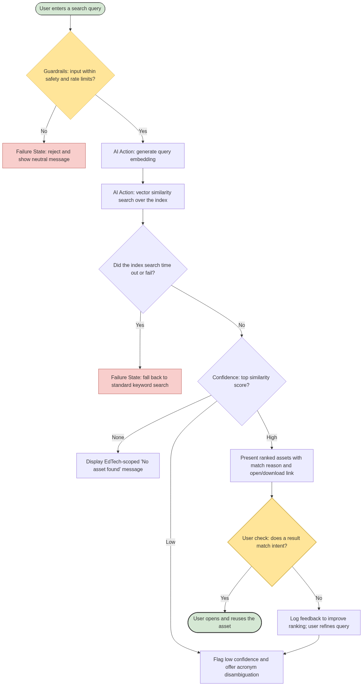

# 🔍 Codebasics Digital Asset Assistant

> **AI PM Capstone 2** — an AI system that lets a content team **find any asset by meaning, not by filename**, so they stop recreating work that already exists.


A decade of creation leaves thousands of assets — course videos, YouTube tutorials, thumbnails, decks, PDFs — scattered across drives with inconsistent names (`final`, `final_v2`, `FINAL_USE_THIS`). Nobody can search *inside* a video or an image, so teams **search, give up, and recreate**. This project fixes that.

---

## 🎯 The problem, in numbers

| | |
|---|---|
| **20 TB** | of deeply-nested, decade-old assets |
| **2,500** | searches per day across a 50-person team |
| **15+ min** | per search — and it often fails |
| **Result** | duplicated decks, thumbnails, and videos |

**Root cause:** Codebasics has no record of what its assets *contain*, so no one can find work by *meaning* — and teams recreate what already exists.

## 💡 The solution

A **local, semantic search**. It reads the text *inside* files (and *inside* YouTube videos via transcripts), turns everything into embeddings **on-device** (open-source, ~$0, private), and returns the right asset with the reason it matched.

**Search by meaning → get the exact file, its location, the slide/page, and a download.**



---

## 🗂️ The 7 capstone steps

| # | Step | Deliverable |
|---|------|-------------|
| 1 | **Problem discovery & user research** (persona, empathy map, 5-Whys, root cause) | [Step 1 (docx)](Deliverables/Step1_DigitalAsset_Problem_Discovery_User_Research.docx) |
| 2 | **AI opportunity mapping** (user journey, opportunity map, architecture, risks) | [Journey](Deliverables/Step2_UshaDigitalAssistant_UserJourney.pdf) · [Opportunity](Deliverables/Step2_UshaDigitalAssistant_AIOpportunityMapping.pdf) · [Block diagram](Deliverables/Step2_UshaDigitalAssistant%20_SystemBlockDiagram.pdf) · [Risks](Deliverables/Step2_UshaDigitalAssistant_Risks.pdf) |
| 3 | **AI PRD** (North Star, guardrails, evals, model strategy) | [Step 3 (docx)](Deliverables/Step3_DigitalAsset_AI_PRD.docx) |
| 4 | **Cost estimation** (local/free vs paid cloud) | [Step 4 (xlsx)](Deliverables/Step4_DigitalAsset_Cost_Estimation.xlsx) |
| 5 | **Working prototype** (this code) | `assistant/`, `streamlit_app.py` |
| 6 | **Presentation** | [Step 6 (pptx)](Deliverables/Step6_DigitalAsset_Presentation.pptx) |
| 7 | **Stakeholder demo video** | _(link)_ |

---

## 🏗️ How it's built (object-oriented)


| Module | Role |
|--------|------|
| `assistant/models.py` | `Asset`, `SearchResult` data objects |
| `assistant/extractors.py` | `TextExtractor` → `Pdf` / `Pptx` / `Image` / `YouTubeTranscript` extractors |
| `assistant/embedder.py` | `Embedder` — text → vector (swap to change models) |
| `assistant/vector_store.py` | `VectorStore` — holds vectors, finds closest |
| `assistant/indexer.py` | `AssetIndexer` — builds the index (with transcript caching) |
| `assistant/search_engine.py` | `SearchEngine` — the core: query → ranked results |
| `assistant/guardrails.py` | `Guardrails` — allowlist, rate limit, English-only, acronyms |

**Pipeline:** read text inside files & videos → embed (local) → on-device index → search + rank by relevance then recency → deliver the file.

## 🛡️ Grounded & safe by design

- **Retrieval-only** — it can only return assets that *exist*; it never generates or fabricates.
- **Local** — proprietary content never leaves the machine.
- **Explainable** — every result shows *why* it matched.
- **Guardrails** — filetype allowlist (ignores `.zip`), out-of-domain "EdTech only" message, English-only, rate limit + timeout.

## 📊 Success metrics

- **North Star:** Asset Reuse Rate ≥ 60% (searches that end in reuse, not recreation)
- Right asset in **top 3 ≥ 90%** · Search **≤ 2 s** · **0** fabricated results

## 💵 Cost

Runs on open-source + free tiers = **~$0**. Because it *retrieves* rather than *generates* (no LLM), per-query cost is pennies even on paid cloud — and it avoids ~$27/mo an LLM-generation approach would cost.

---

## ▶️ Run it locally

```bash
python -m venv .venv
.venv\Scripts\activate          # Windows
pip install -r requirements.txt
python build_index.py           # build the search index (once)
streamlit run streamlit_app.py  # open the app
```

Then search: `power bi thumbnail`, `machine learning`, `star schema`.

> **Note:** the sample dataset is provided by the Codebasics capstone. Video transcripts use the free `youtube-transcript-api`; YouTube may rate-limit repeated fetching, so transcripts are **cached** after the first successful build.

---

*Built by Ushasree Jakilinki · AI Product Management Capstone.*
